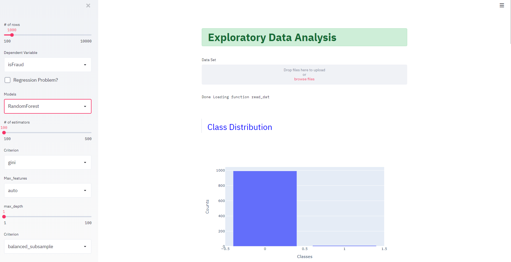
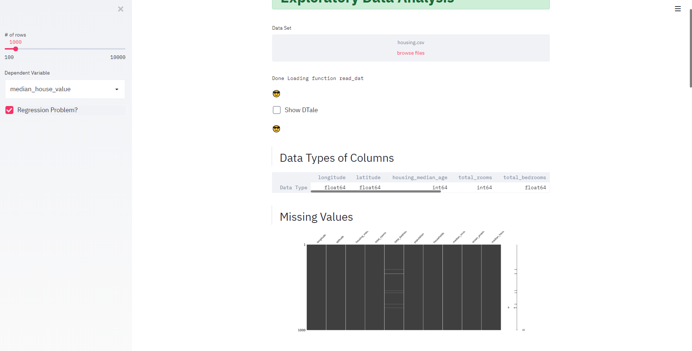
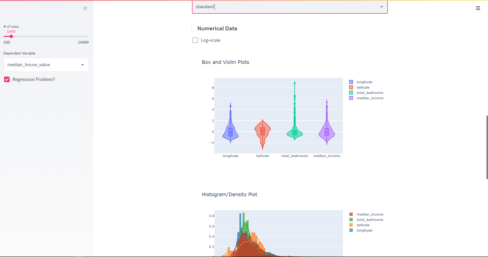

# A Simple Data Exploratory App using Streamlit

1. Provides interactive tools to explore data, normalize, scale and view outliers

2. Provides simple modeling strategies to understand the data better

3. It should be used ONLY to obtain a better understanding of the underlying data and not to develop models

4. The script is deployed as an app @ https://arcane-headland-76563.herokuapp.com/

## Usage Description
+ Install streamlit, pps_score, giotto-tda, D-Tale, Missingno and other dependencies
+ Run as ```streamlit run eda.py```
+ Upload your favorite csv file
+ Check out 

## Features
1. 
* Snapshots



References:

* [Predictive Power Score](https://github.com/8080labs/ppscore)
* [Mapper Algorithm](https://arxiv.org/abs/2004.02551)
* [Streamlit](https://github.com/streamlit/streamlit)
* [D-Tale](https://github.com/man-group/dtale)
* [Missingno](https://github.com/ResidentMario/missingno)
